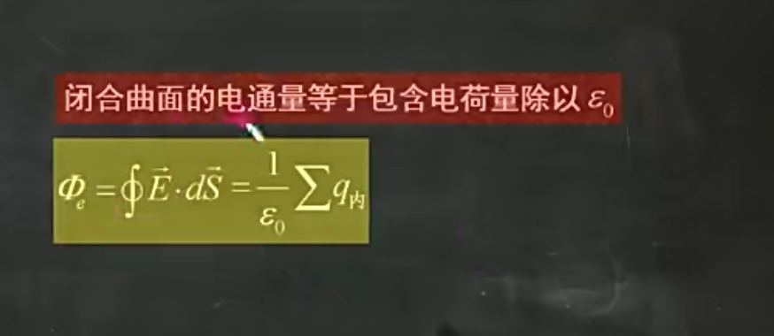

# 基于ROS1的老人看护机器人

## 一、在使用该开源代码之前，需要具备以下条件：

1.拥有激光雷达、深度相机、可以部署ROS1_noetic版本的派、ROS机器人驱动板
2.在派中烧入地平线ubuntu21的镜像

## 二、安装相关功能包

启动RDK X3后，通过ssh或者VNC连接x3派

使用鱼香ROS一键安装vscode与ROS1_noetic，再安装超级终端，由于我们使用的是STM32_ROS驱动板，所以还需要对Rosmaster库进行安装

```python
wget http://fishros.com/install -O fishros && . fishros 
#鱼香ros进行一键安装
sudo apt install terminator #安装超级终端
#####验证ros是否安装成功################
roscore#在一个terminal中输入
rosrun turtlesim turtlesim_node#另一个terminal创建小乌龟界面
rosrun turtlesim turtle_teleop_key#另外一个terminal控制小乌龟的移动
```

执行命令之后，出现下图所示的图像，则为安装ROS成功

![image-20240630170749753.png]


若运行roscore出现如下报错，详情请参考以下博客

[error while loading shared libraries: libroscpp.so: cannot open shared object file: No such file or-CSDN博客](https://blog.csdn.net/weixin_46639310/article/details/133024546?utm_medium=distribute.pc_relevant.none-task-blog-2~default~baidujs_baidulandingword~default-0-133024546-blog-106345777.235^v43^pc_blog_bottom_relevance_base3&spm=1001.2101.3001.4242.1&utm_relevant_index=1)


## 三、创建工作空间

创建ROS的工作空间，移植仓库代码至该工作空间，并将仓库中的zip压缩包进行解压,记得在bashrc文件中配置工作空间，以及配置雷达的型号参数

```python
gedit ~/.bashrc #进入bashrc文件
sudo unzip file.zip #解压命令
```


如上图所示，我们选用的雷达为a1型号的思岗雷达，创建的工作空间名为catin_ms，所以在bashrc文件当中吗。进行了如下的配置。


编译工作空间

```python
catkin_make #编译
```

运行launch文件

```
rosluanch bodyreder bodyfollow.launch
```

若成功运行launch文件，则可以实现机器人的跟随人体以及避障功能

